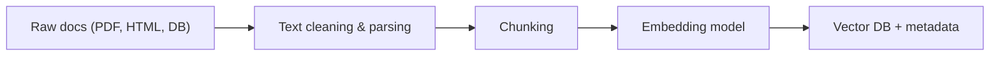

# Questions and answers about LLMs 

Here are some questions that I have stumpoind appass/ask myself during lectures/reading/youtube video and I will try to keep it updated and clean with quick answer.

## RAG 

### What does RAG stand for ? 
>Retrieval-Augmented Generation

**One sentence definition :**
Retrieval-Augmented Generation (RAG) is an architecture where a retriever pulls relevant documents from an external knowledge base, and an LLM uses them to produce grounded answers instead of relying only on its internal weights.

### Why use RAG  ? 
- Give the model access to fresh / private data without retraining (docs, DBs, wikis, invoices, etc...).
- Reduce hallucinations by forcing the model to answer “using these documents only”.
- Keep a single general LLM and specialize behavior by changing the retrieved context.
​

### How does RAG work ? 

**1. Indexing Pipeline (Preparation)**

**2. The Retrieval & Generation Loop (Execution)**

### Why use fine-tune or RAG ? 

**RAG** : Does not modify the model weights. You only update the document database.  
It keeps results fast and fresh, and you can easily control which documents are used by the system.

**Fine-tuning** : Modifies the model itself, which means you need more resources to train it,  
and you have less flexibility once the model is fine-tuned.

To be synthetic :
- Fine-tuning optimizes behavior and reasoning patterns
- RAG extends accessible knowledge (memory)
